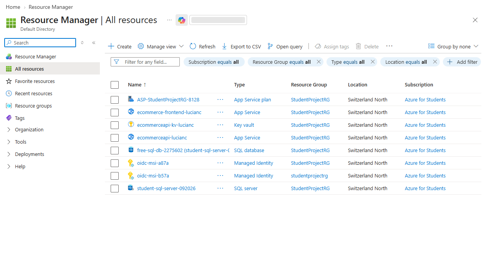
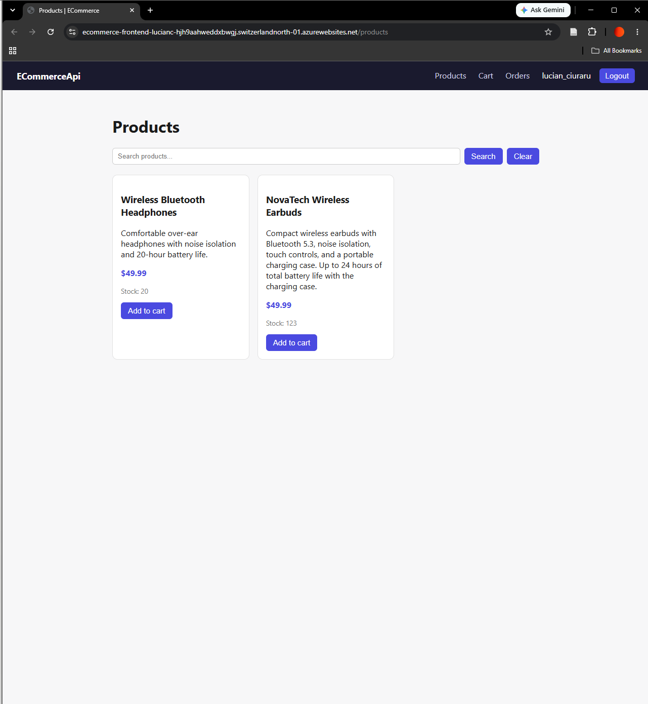
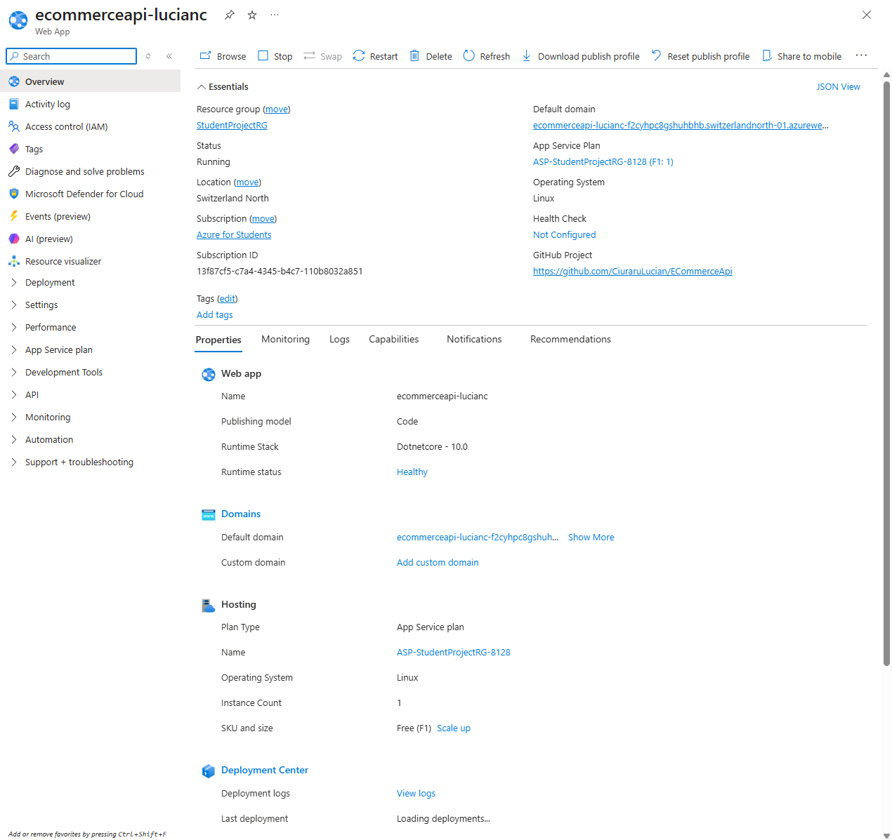
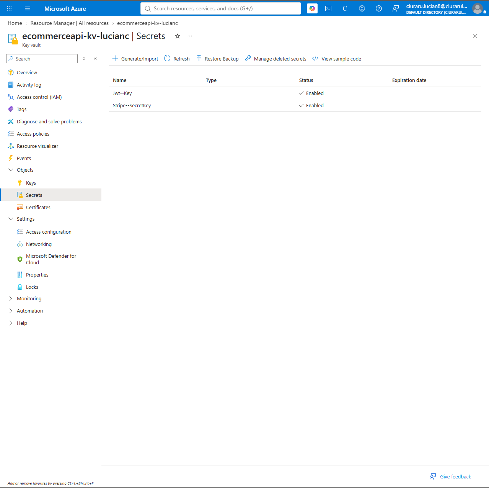
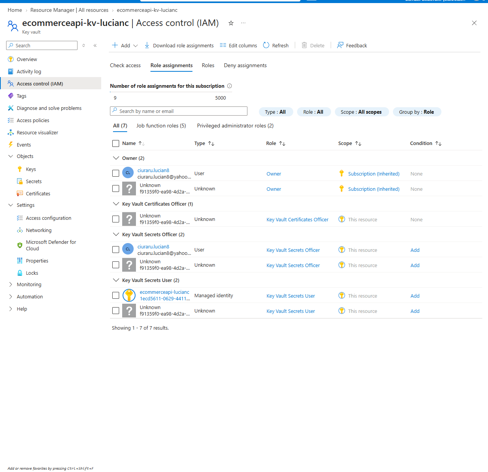

# Azure Deployment

This project is deployed to Azure as a hands-on application of concepts covered in the **AZ-900** (Azure Fundamentals) and **DP-900** (Azure Data Fundamentals) certifications — moving from an entirely local setup (SQLite, local Redis, secrets in config files) to a cloud-hosted architecture using managed Azure services.

## Live URLs

- **Frontend:** https://ecommerce-frontend-lucianc-hjh9aahweddxbwgj.switzerlandnorth-01.azurewebsites.net
- **Backend API:** https://ecommerceapi-lucianc-f2cyhpc8gshuhbhb.switzerlandnorth-01.azurewebsites.net

## Screenshots

**All provisioned Azure resources**



**Live deployed frontend**



**Backend App Service overview**



**Key Vault secrets**



**Managed Identity access to Key Vault**



---

## Architecture

| Local (development) | Azure (deployed) |
|---|---|
| SQLite file | Azure SQL Database |
| Local Redis instance | *(no managed cache — see note below)* |
| Secrets in `appsettings.Development.json` | Azure Key Vault |
| `dotnet run` on localhost | Azure App Service (backend) |
| `npm start` on localhost | Azure App Service (frontend) |
| Manual config values | System-assigned Managed Identity (no stored credentials) |

**Caching note.** Redis is used for distributed caching only in local development, where it's free and already running on the developer's machine. Running a managed Redis instance in Azure turned out to be the single most expensive resource in the whole setup, with cost scaling by capacity rather than usage — not a reasonable trade-off for a free-tier student project. The app checks for a `Redis:Connection` configuration value at startup:

```csharp
var redisConn = builder.Configuration["Redis:Connection"];

if (!string.IsNullOrWhiteSpace(redisConn))
{
    builder.Services.AddStackExchangeRedisCache(o => o.Configuration = redisConn);
}
else
{
    builder.Services.AddDistributedMemoryCache();
}
```

Locally, that value is set, so the app gets real distributed caching against Redis. In Azure, the `Redis:Connection` secret was deleted from Key Vault along with the Redis resource itself, so the app falls back to `AddDistributedMemoryCache()` — an in-process cache with the same `IDistributedCache` interface. The rest of the app (cache reads, writes, and invalidation in `ProductsController`) is unaffected either way, since it only ever depends on the `IDistributedCache` abstraction, not on Redis specifically. The trade-off: the deployed app's cache doesn't survive a restart and wouldn't be shared across multiple instances — acceptable here since it's a single Free-tier instance, but worth calling out as something a real production deployment would revisit.

## Resources provisioned

| Resource | Type | Purpose |
|---|---|---|
| `student-sql-server-092026` | SQL Server | Hosts the application database |
| `free-sql-db-2275602` | SQL Database | Application data (Free tier) |
| `ecommerceapi-kv-lucianc` | Key Vault | Stores JWT signing key and Stripe secret key |
| `ecommerceapi-lucianc` | App Service (Linux) | Hosts the ASP.NET Core API (Free F1) |
| `ecommerce-frontend-lucianc` | App Service (Linux) | Hosts the Node/Express + EJS frontend (Free F1) |
| `ASP-StudentProjectRG-8128` | App Service Plan | Shared hosting plan for both App Services |

> An Azure Managed Redis instance was provisioned earlier in this project and later deleted. Its cost scaled with provisioned capacity rather than actual usage, which didn't fit a free-tier student project — see the caching note above for how the app handles its absence.

All resources sit in a single resource group (`StudentProjectRG`) under an **Azure for Students** subscription, in the **Switzerland North** region.

## Key configuration changes for cloud deployment

**Database provider swap.** `AppDbContext` was switched from `UseSqlite(...)` to `UseSqlServer(...)`, and all EF Core migrations were regenerated from scratch, since the original SQLite-generated migrations used column types (e.g. `TEXT` primary keys) that SQL Server doesn't support the same way.

**Secrets moved out of source control.** The JWT signing key and Stripe secret key were removed from `appsettings.Development.json` and stored in Azure Key Vault instead, wired in via:
```csharp
builder.Configuration.AddAzureKeyVault(
    new Uri(keyVaultSettings.Uri),
    new DefaultAzureCredential());
```
Locally, `DefaultAzureCredential` authenticates using the developer's `az login` session. Once deployed, the App Service's **system-assigned managed identity** authenticates instead — no credentials are stored anywhere in the app itself, locally or in Azure.

Key Vault is registered unconditionally (not skipped in Development) and takes precedence, then `appsettings.Development.json` is layered back on top in Development only — so any value filled in locally (a test-mode Stripe key, a local Redis connection) overrides Key Vault, while anything left blank locally still falls through to the Key Vault value. This ordering also avoids a subtle bug where skipping Key Vault registration in Development changed which credential probe `DefaultAzureCredential` ran first for the *SQL connection's own* Azure AD auth, causing it to try (and time out on) a managed-identity check before falling back to the Azure CLI login.

**Safety net against a live Stripe key in Development.** Regardless of how configuration precedence resolves, the app refuses to start in Development if the resolved Stripe key starts with `sk_live_` — a deliberate guard against `Checkout` accidentally creating a real PaymentIntent (i.e. actually charging money) while testing locally.

**Typed settings, not raw string lookups.** Configuration sections like CORS and Key Vault are bound to small typed classes (`CorsSettings`, `KeyVaultSettings`) via a `GetRequiredSettings<T>()` extension method, rather than read ad hoc with `builder.Configuration["Cors:AllowedOrigins"]`. A missing or misconfigured section fails fast at startup with a clear error, instead of surfacing later as a null-reference or a silently-empty CORS policy.

**CORS is configuration-driven**, sourced from `CorsSettings.AllowedOrigins` rather than a hardcoded string, so the allowed origin is set per environment (`localhost:3000` locally, the deployed frontend's URL in Azure) without a code change.

**SQL Server firewall** was configured to allow Azure services (`Allow Azure services and resources to access this server`), since the deployed App Service's outbound IP isn't a fixed developer IP that can be added manually.

## Cost

All resources use free or lowest-cost tiers (App Service Free F1, SQL Database Free tier) and run against Azure for Students credit — no payment method is attached to the subscription, so there is no risk of unexpected charges. Azure Managed Redis was removed from the architecture specifically because it didn't fit this cost model (see the caching note above), leaving the deployment entirely within free-tier resources.
