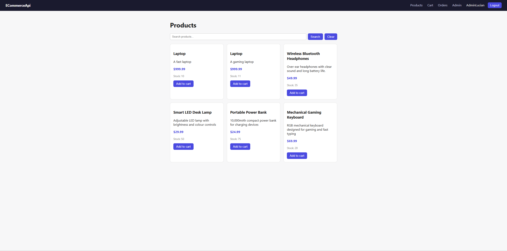
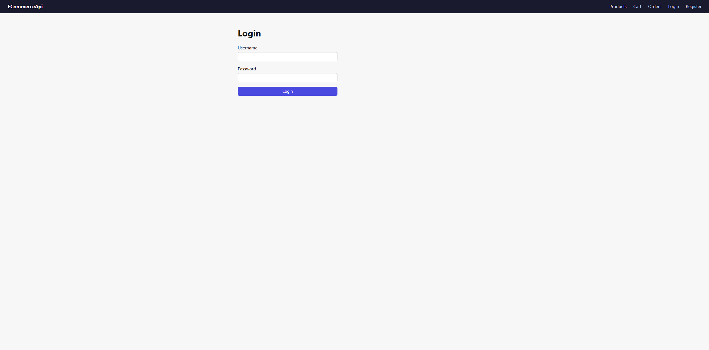
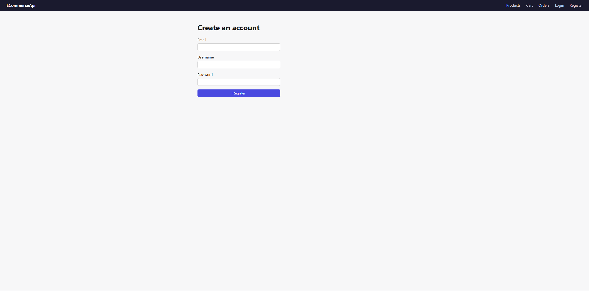
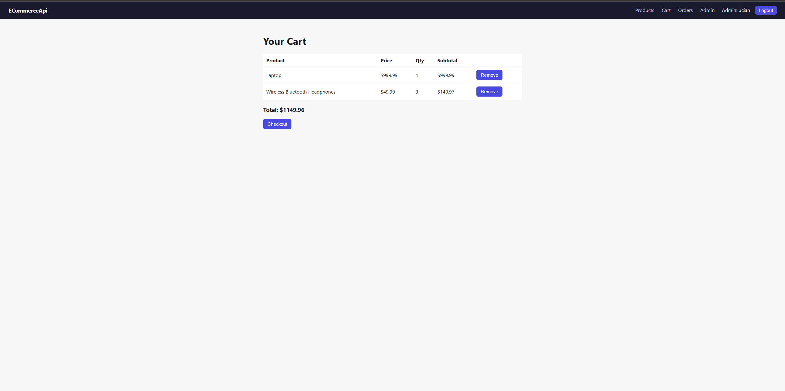
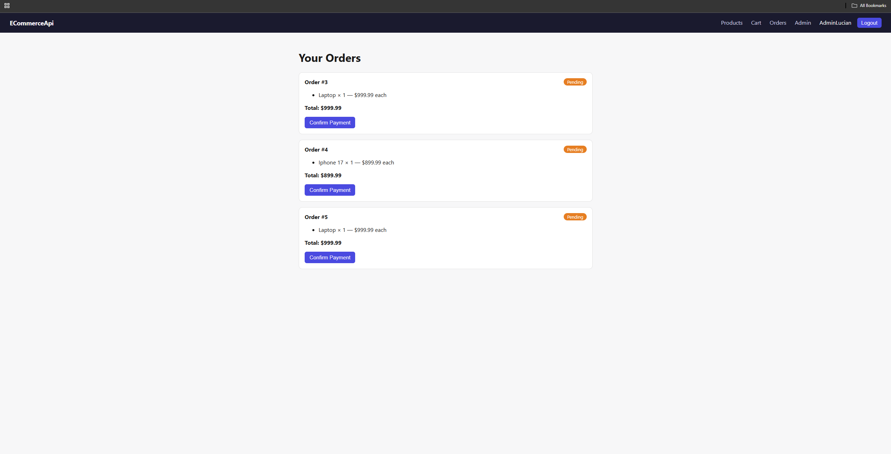
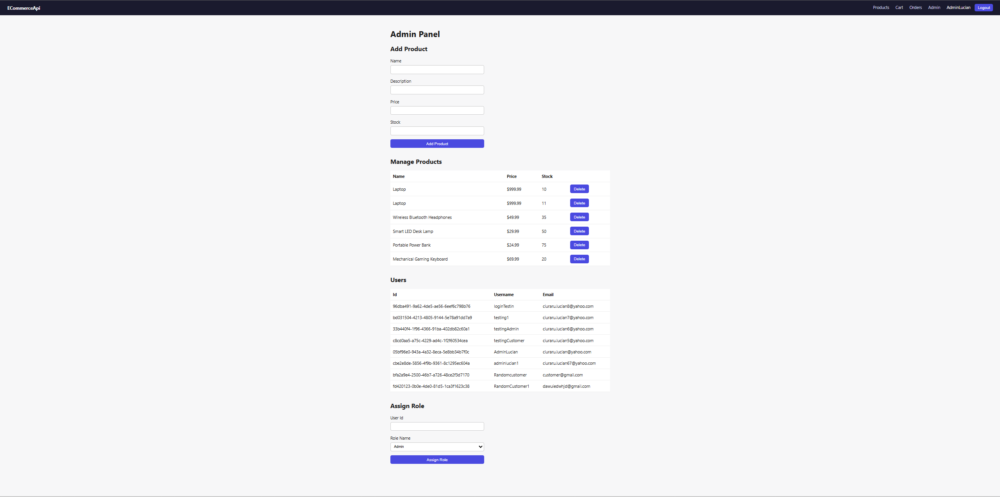
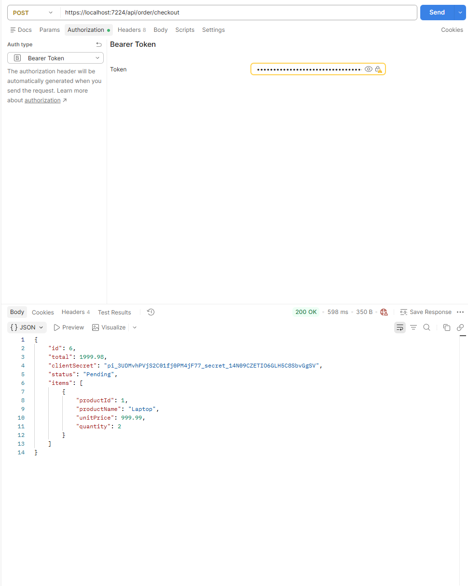
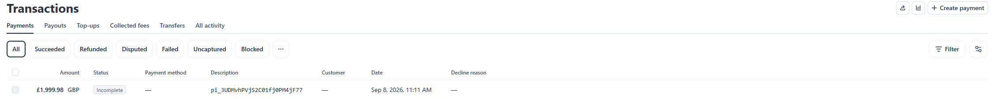
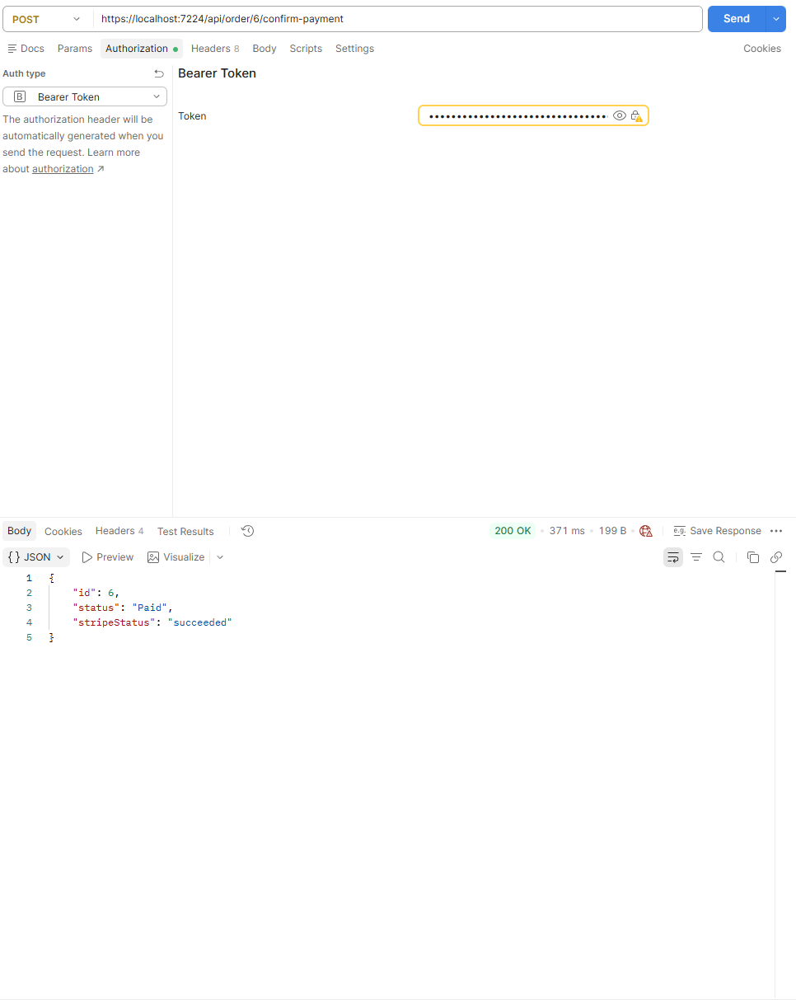
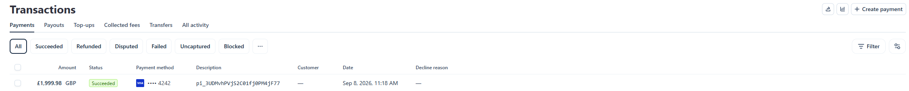

# ECommerceApi

A full-stack e-commerce platform built as a learning project, featuring a secure ASP.NET Core Web API backend with JWT authentication, role-based authorization, Stripe payment integration, Redis caching, and a lightweight Node/EJS frontend for demonstrating the full user flow end to end.

This project was built incrementally, one feature at a time, with an emphasis on understanding *why* each architectural decision was made — not just copying a tutorial. See the [Architecture Decisions](#architecture-decisions) section below for the reasoning behind some of the less obvious choices.

---

## Screenshots

**Product listing page**



**Login / Register**




**Shopping cart**



**Order history**



**Admin panel** — add products, manage users, assign roles



**Checkout — Postman response with Stripe PaymentIntent**



**Payment lifecycle in Stripe (test mode)**

The order above starts as `Pending` in Stripe:



After the payment is confirmed via `POST /api/order/{id}/confirm-payment`:



...and the same PaymentIntent now shows as `Succeeded` in the Stripe dashboard:



---

## Features

- **User authentication** — register/login with ASP.NET Core Identity, secured with JWT bearer tokens
- **Role-based authorization** — users can hold multiple roles (Customer, Admin) via Identity's role system, enforced through `[Authorize(Roles = "...")]`
- **Product catalog** — browse, search, and (for admins) create/update/delete products with inventory tracking
- **Shopping cart** — add, remove, and view cart items, scoped per authenticated user
- **Checkout & payments** — cart-to-order conversion with Stripe PaymentIntent creation, plus a payment confirmation endpoint
- **Order history** — users can view their past orders and current payment status
- **Admin panel** — manage products, view/manage users, and assign roles, all gated behind Admin-only endpoints
- **Redis caching** — product listings are cached to reduce database load, with automatic cache invalidation on writes
- **Rate limiting** — login and registration endpoints are protected against brute-force attempts
- **Automated testing** — 100+ xUnit tests covering controllers, DTO validation, and configuration
- **Frontend** — a simple Node/Express + EJS interface that consumes the API directly, so the whole flow can be tested visually without Postman

---

## Tech Stack

**Backend**
- C# / ASP.NET Core Web API
- Entity Framework Core (Fluent API for model configuration)
- SQLite (database)
- ASP.NET Core Identity (authentication & role management)
- JWT Bearer Authentication
- Stripe.net (payment processing)
- Redis / StackExchange.Redis (distributed caching)
- xUnit (automated testing)

**Frontend**
- Node.js / Express
- EJS (templating)
- HTML5 / CSS3
- Vanilla JavaScript (fetch API)

**Tooling**
- Visual Studio / Visual Studio Code
- Postman (API testing)
- Git

---

## Architecture Decisions

A few choices worth calling out, since they reflect deliberate trade-offs rather than defaults:

**Order snapshotting.** `OrderItem` does *not* hold a live foreign key to `Product`. Instead, it stores a copy of the product's name and price at the moment of purchase (`ProductName`, `UnitPrice`). This is intentional: an order is a historical record of what a customer agreed to pay. If a product's price changes after the fact, past orders should not silently reflect the new price — that would misrepresent what actually happened at checkout.

**Identity roles instead of a single role field.** Users can hold multiple roles simultaneously (e.g. a user could be both a Customer and an Admin) via ASP.NET Core Identity's built-in `AspNetUserRoles` join table, rather than a single `Role` string column. This is more realistic for real-world systems and avoids awkward "what if someone needs two roles" edge cases later.

**Fluent API over data annotations.** Entity relationships (Cart↔User, Cart↔CartItem↔Product, Order↔OrderItem) are configured via `IEntityTypeConfiguration<T>` classes rather than attributes on the models. This keeps the domain models clean and makes relationship behavior (like cascade vs. restrict on delete) explicit and easy to reason about in one place.

**Cache invalidation on write.** Product data is cached in Redis on read, but every admin write operation (create/update/delete) explicitly clears the relevant cache key. This avoids serving stale product data after an admin makes a change, at the cost of a small amount of extra code in each write path.

---

## Project Structure

```
ECommerceApi/
├── backend/
│   ├── Controllers/         # API endpoints
│   ├── Models/               # EF Core entities
│   ├── DTOs/                 # Request/response shapes
│   ├── Data/
│   │   ├── AppDbContext.cs
│   │   └── Configurations/   # Fluent API entity configurations
│   ├── Services/              # JWT generation, etc.
│   ├── Migrations/            # EF Core migrations
│   └── ECommerceApi.Tests/    # xUnit test project
└── frontend/
    ├── views/                 # EJS templates
    ├── public/
    │   ├── css/
    │   └── js/                # Client-side logic (fetch calls to the API)
    └── server.js
```

---

## Getting Started

### Prerequisites
- .NET SDK 8+ (or whichever version this project targets)
- Node.js 18+
- Redis (running locally, e.g. via the Windows installer or Docker)
- A [Stripe](https://stripe.com) account (test mode is sufficient)

### Backend setup

```bash
cd backend
dotnet restore

# Add your own secrets to appsettings.Development.json (see appsettings.json for the expected shape):
# - Jwt:Key, Jwt:Issuer, Jwt:Audience
# - Stripe:SecretKey (test key, starts with sk_test_)
# - Redis:Connection (e.g. localhost:6379)

dotnet ef database update
dotnet run --launch-profile https
```

The API will be available at `https://localhost:7224`.

### Frontend setup

```bash
cd frontend
npm install
npm start
```

The frontend will be available at `http://localhost:3000`.

> ⚠️ Make sure Redis is running locally before starting the backend, and that the backend's CORS policy includes the frontend's origin (already configured for `http://localhost:3000`).

### Running tests

```bash
cd backend/ECommerceApi.Tests
dotnet test
```

---

## API Overview

| Area | Endpoints |
|---|---|
| Auth | `POST /api/auth/register`, `POST /api/auth/login` |
| Products | `GET /api/products`, `GET /api/products/{id}`, `GET /api/products/search`, `POST/PUT/DELETE /api/products` *(Admin)* |
| Cart | `GET /api/cart`, `POST /api/cart`, `DELETE /api/cart/{productId}` |
| Orders | `POST /api/order/checkout`, `GET /api/order`, `GET /api/order/{id}`, `POST /api/order/{id}/confirm-payment` |
| Users | `GET/PUT/DELETE /api/user/{id}` *(Admin)* |
| Roles | `POST /api/role/assign` *(Admin)* |

A Postman collection is included in the repository for manual testing of every endpoint.

---

## Known Limitations

- JWTs are stored in `localStorage` on the frontend for simplicity; a production system would use httpOnly cookies to reduce XSS exposure.
- The database is SQLite, chosen for zero-setup local development — a production deployment would use SQL Server or PostgreSQL.
- Stripe payment confirmation is triggered manually via an endpoint rather than through a webhook, which is the production-correct approach for reliably detecting payment completion.

---

## Author

Built by [Lucian Ciuraru](https://github.com/CiuraruLucian) as a learning project covering backend architecture, authentication, payments, caching, and testing in ASP.NET Core.
